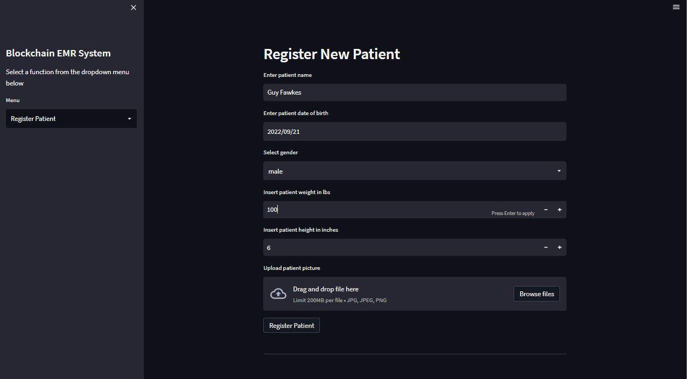
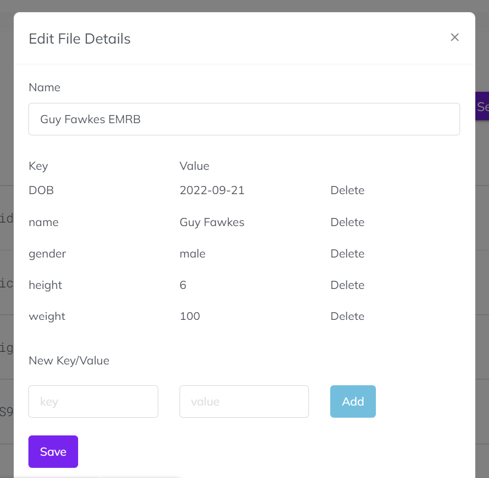
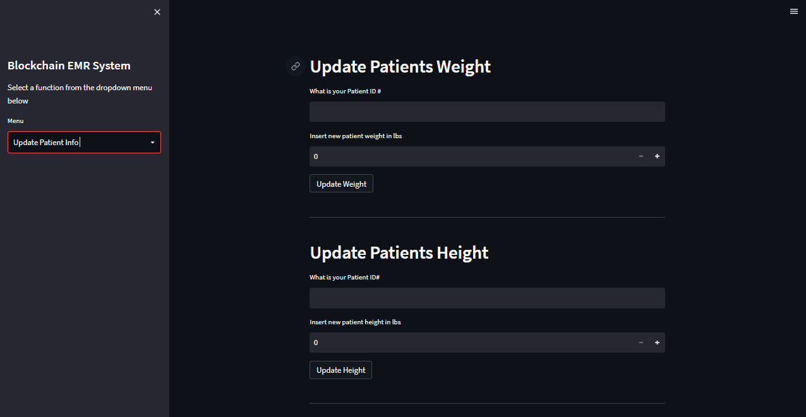
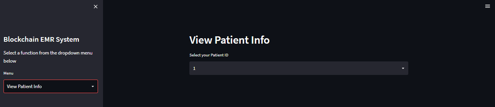

# Forward Health
Secure Electronic Health Records


# Our Solution
We use blockchain technology to securely manage health records for a collaborative, smart approach to healthcare.

## Keeping medical data safe

Blockchain’s ability to keep an incorruptible, decentralized and transparent log of all patient data makes it a technology rife for security applications

## Transparency 
Additionally, while blockchain is transparent, it is also private, concealing the identity of any individual with complex and secure codes that can protect the sensitivity of medical data. 

## Decentralize
The decentralized nature of the technology also allows patients, doctors and healthcare providers to share the same information quickly and safely. 

# Installation

To clone the project:

```sh
git clone https://github.com/santiago-pesantez/emr-blockchain.git
cd emr-blockchain/
```

## dApp

To deploy the smart contracts we will use [Remix IDE](https://remix.ethereum.org/)
1. Make sure you have a [Pinata](https://www.pinata.cloud/) account.
2. Use you pinata credentials in the `.env` file, to use the API
3. For testing purposes we recomend using [Ganache](https://trufflesuite.com/ganache/) as your personal blockchain
4. Make sure you have configured your MetaMask wallet, and connect it to Ganache
5. Open the smart contract file in `Remix`
6. Select Compiler Version 0.5.1.7+commit.d19bba13 and compile it
7. Deploy it to the Blockchain (You can use `MetaMask` to connect to the Blockchain)
8. With the contract address and the `Contract ABI` details we can run our dApp
9. Use the command `streamlit run` to run the application

# Usage

From the side-bar you can choose one of the following actions:

## Register New Patient



### Pinata (IPFS)



## Update Information



## View Information




## License

[](https://www.gnu.org/licenses/gpl-3.0)